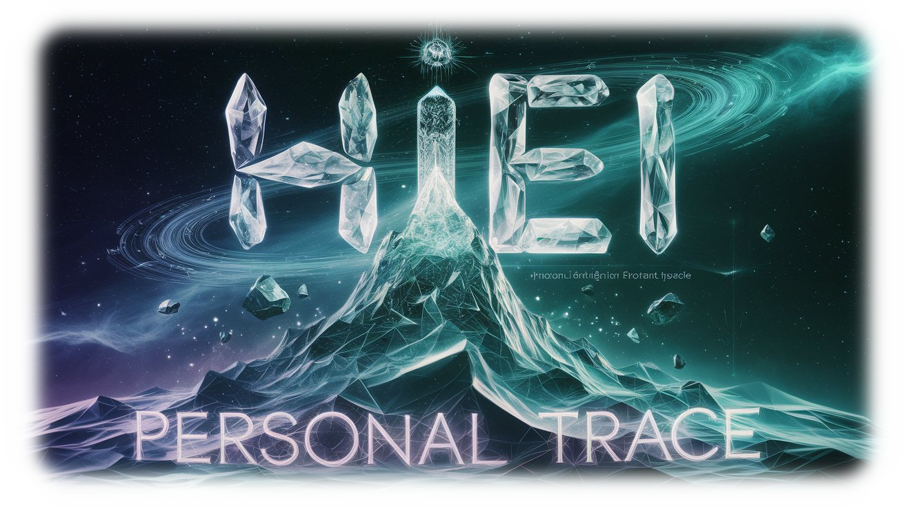

<p align="center">
  
  <h1 align="center">🌟 HIEI 🌟</h1>
</p>
<p align="center">
  <a href="https://github.com/Sunwood-ai-labs/HIEI-personal-trace">
    
  </a>
  <a href="https://github.com/Sunwood-ai-labs/HIEI-personal-trace/blob/main/LICENSE">
    
  </a>
  <a href="https://github.com/Sunwood-ai-labs/HIEI-personal-trace/stargazers">
    
  </a>
  <a href="https://github.com/Sunwood-ai-labs/HIEI-personal-trace/releases">
    
  </a>
  <a href="https://github.com/Sunwood-ai-labs/HIEI-personal-trace/issues">
    
  </a>
  <a href="https://github.com/Sunwood-ai-labs/HIEI-personal-trace/pulls">
    
  </a>
  <a href="https://github.com/Sunwood-ai-labs/HIEI-personal-trace/network/members">
    
  </a>
  <a href="https://github.com/Sunwood-ai-labs/HIEI-personal-trace/watchers">
    
  </a>
  
  
</p>
<h2 align="center">
  ～ AI-Powered Automated Repository Management Template ～

<a href="https://github.com/Sunwood-ai-labs/HIEI-personal-trace/blob/main/README.md"></a>
<a href="https://github.com/Sunwood-ai-labs/HIEI-personal-trace/blob/main/docs/README.en.md"></a>
</h2>
<p align="center">
  
  
  
  
  
  
  
  
  
  
</p>
<p align="center">
  <a href="https://github.com/Sunwood-ai-labs/AIRA">
    
  </a>
  <a href="https://github.com/Sunwood-ai-labs/IRIS">
    
  </a>
</p>


> [!IMPORTANT]
>  HarmonAI IIIは、[cline (旧:Claude Dev)](https://github.com/clinebot/cline), [SourceSage](https://github.com/Sunwood-ai-labs/SourceSage), [claude.ai](https://claude.ai/)を活用して開発されたテンプレートリポジトリです。リリースノート、README、コミットメッセージの大部分は、最新のAI技術を用いて生成されています。

## 🚀 プロジェクト概要

HIEIは、あなたのPC作業を自動的に記録し、後で活用できるようにするツールです。

## 🌟 特徴

- **キーログ記録**
  - 入力内容の記録
  - タイムスタンプ付きで保存
  
- **クリップボード監視**
  - コピー内容の記録
  - 履歴の保持

- **セキュリティ重視**
  - センシティブ情報の自動フィルタリング
  - ローカルでの安全な保存

## 🚀 使い方

```bash
# インストール
pip install hiei

# 記録開始
hiei start

# 状態確認
hiei status

# 記録停止
hiei stop
```

## 📋 必要要件

- Python 3.9以上
- OS: Windows/Mac/Linux

## 🛠️ インストール

```bash
# リポジトリのクローン
git clone https://github.com/yourusername/hiei.git
cd hiei

# 依存関係のインストール
pip install -r requirements.txt
```

## 🔒 プライバシーについて

- すべてのデータはローカルに保存されます
- パスワードなどの機密情報は自動的にフィルタリングされます
- 保存データは暗号化されます

## 📜 ライセンス

[MIT License](LICENSE)の下で公開されています。
